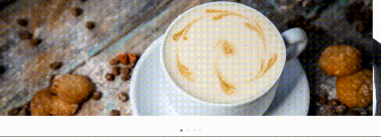

# ELNBehaviors

Коллекция поведений пользовательского интерфейса.

- `ELNPaginatedScrollViewBehavior`

## Installation

###Cocoapods

```
source 'https://github.com/CocoaPods/Specs.git'
source 'https://github.com/elegion/ios-podspecs'

pod 'ELNBehaviors' 
```

###Carthage

```
github 'elegion/ios-ELNBehaviors'
```

## Usage 

###ELNPaginatedScrollViewBehavior

Связывает `UIScrollView` и `UIPageControl` для постраничной навигации. Используется для отображения баннеров или галлереи картинок:



```objective-c
@interface MyCustomViewController : UIViewController 

@property (nonatomic, strong) IBOutlet UICollectionView *collectionView;
@property (nonatomic, strong) IBOutlet UIPageControl *pageControl;
@property (nonatomic, strong) ELNPaginatedScrollViewBehavior *scrollBehavior;

@end

@implementation MyCustomViewController

- (void)viewDidLoad {
	[super viewDidLoad];

    self.scrollBehavior = [[ELNPaginatedScrollViewBehavior alloc] initWithPageControl:self.pageControl scrollView:self.collectionView];
    self.scrollBehavior.autoScrollTimeInterval = 8;
}

@end
```

## Contribution

###Cocoapods

```sh
# download source code, fix bugs, implement new features

pod repo add legion https://github.com/elegion/ios-podspecs
pod repo push legion ELNBehaviors.podspec
```

##TODO

- hide keyboard by tap behavior (gesture recognizer based)
